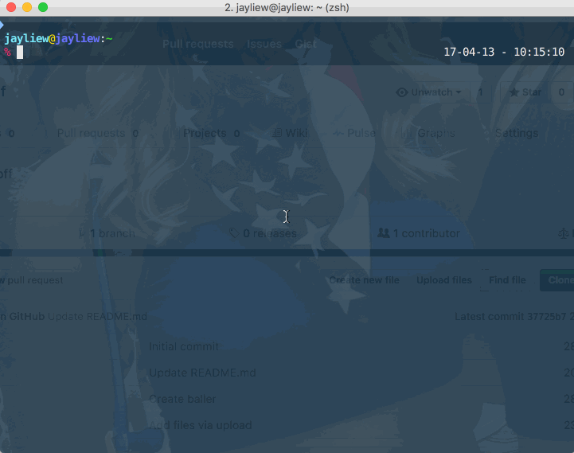

# baller-af

So that you can be baller af when you are showing off stuff via command line

# WHY
Q: Why not just run the `figlet` command and pipe results to `lolcat`?

A: Because you'd be stuck with 1 default font for your figlet, which gets in the way of showboating. Manually figuring out the commands to change the font involve searching for your figlet's font directory, and manually picking a font from a huge list--but not before first pruning that list from incompatible figlet font files. Having to think means increased friction, which leads to less usage. Low friction = higher usage.

# PRE-REQUISITES
1. figlet (`brew install figlet` on OS X, or `aptitude install figlet` on Ubuntu)
2. lolcat (`brew install lolcat` on OS X, or `aptitude install lolcat` on Ubuntu)

# INSTALLATION
1. Put this script somewhere in your executable path, preferably where all the 
3rd party user libs are e.g. /usr/local/bin 
2. chmod u+x
3. baller af away

# USAGE
zsh> baller hello world

NOTE: 
Shell will always try to interpret your input first, so for instance, if you have 
an apostrophe, you'll need to escape by adding double quotes around your input

e.g. 

zsh> baller "Hello world, I've arrived"

# MISC

:copyright: (c) 2017 by Jay Liew

:license: MIT
